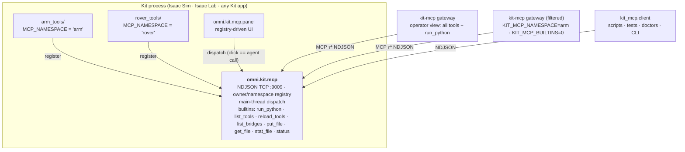

# omni-kit-mcp

Infrastructure for driving **Omniverse Kit** apps — Isaac Sim, Isaac Lab, or
any Kit-based app — over the **Model Context Protocol**.

**One bridge, one port, per Kit process.** Projects register tools under a
namespace; name collisions between projects are impossible by construction
(two projects can each ship a `play_scene` — they land as `arm.play_scene`
and `rover.play_scene`), so co-loaded projects share the single socket.



## Setup (once per machine)

Register the bridge permanently (afterwards, launches need no flags or env
vars):

```bash
python3 scripts/install.py            # add --dry-run to preview
```

This edits the Kit app's persistent `user.config.json` (the scriptable
equivalent of the Extensions window's AUTOLOAD checkbox): adds `exts/` as a
search path, auto-enables `omni.kit.mcp` + `omni.kit.mcp.panel`, and sets the
bridge port (default **9009**). Restart the app; the bridge binds with the
built-in tools. `--remove` undoes it.

Apply registrations while the app is **down**: a running app rewrites
`user.config.json` from its in-memory settings during its graceful-exit flush,
silently discarding edits made underneath it. (Corollary: a hard `kill -9`
skips that flush, so a registration written while the app ran survives a hard
kill — but don't lean on it; install-while-down is the reliable path.)

Connect an agent/IDE — install the front-end (`pip install -e .` or `uv sync`)
and add to `.mcp.json` (Claude Code, Cursor, etc.):

```json
{
  "mcpServers": {
    "kit": { "command": "kit-mcp" }
  }
}
```

No port needed — the gateway discovers a lone running bridge. Pin one with
`"env": { "OMNI_KIT_MCP_PORT": "9009" }` when several Kit processes run.

That alone is fully usable: `run_python` executes arbitrary Python on Kit's
main thread (persistent sessions supported; saved session vars auto-clear when
a new stage opens — they hold prim/handle references the new stage kills),
which reaches everything in the sim. Tools discovered from the bridge appear as native MCP tools
(`robot_demo.spawn_robot` → `robot_demo__spawn_robot`; dots are illegal in MCP names).

## Adding a project (the contract)

A project is a **plain Python package** — not a Kit extension. It declares a
namespace and exposes one entrypoint (copy `examples/demo_tools/`):

```python
# ~/myproj/isaac/myproj_tools/__init__.py
MCP_NAMESPACE = "robot_demo"                       # defaults to the module name

def register(registrar):                   # receives an owner-bound registrar
    @registrar.tool("Spawn a robot into the scene.", {"name": {"type": "string"}})
    def spawn_robot(name: str = "robot_1"):
        import omni.usd                    # Kit imports live inside handlers
        ...
        return {"path": f"/World/{name}"}  # payload only — no envelope
```

Register it persistently (once per project):

```bash
python3 scripts/install.py add-project --path ~/myproj/isaac --module myproj_tools
```

Next launch, the bridge advertises `robot_demo.spawn_robot`; the panel grows a `robot_demo`
section; agents see it after `refresh_tools`. Per-launch override instead of
persistence: `KIT_MCP_TOOL_PATHS=~/myproj/isaac KIT_MCP_TOOL_MODULES=myproj_tools`.

> **One registration, three surfaces.** A registered tool isn't just an agent
> verb: the control panel renders it as a clickable widget automatically, and
> the reference client/CLI can call it from scripts — all three go through the
> same dispatch entrance. Write the tool once; button, agent call, and script
> call come with it.

Handler contract: params arrive as kwargs; return a JSON-serializable payload
(`None` → `{}`) or raise (`ToolError` attaches diagnostics like captured
stdout). Sync or async. The bridge owns the envelope and the main-thread hop.

**Curated per-project agent views** — same binary, same socket, different env:

```json
"robot-demo-agent": {
  "command": "kit-mcp",
  "env": { "OMNI_KIT_MCP_PORT": "9009",
           "KIT_MCP_NAMESPACE": "robot_demo",
           "KIT_MCP_BUILTINS": "0" }
}
```

exposes only `robot_demo.*` — no `run_python` — for agents that should stay on the
stable API. `run_python` is the operator's escape hatch and how tools are
prototyped; registered tools are what agents rely on.

## Scripting the bridge (no MCP needed)

The bridge's wire protocol is not MCP — the gateway above is the only MCP
speaker. For scripts, tests, and health checks, use the **reference client**
(stdlib-only, single-file, also copyable as-is):

```python
from kit_mcp.client import call, BridgeClient, BridgeError
call("demo.ping", {"message": "hi"})                 # one-shot; endpoint auto-discovered
with BridgeClient() as c:                            # persistent + reconnect
    c.call("run_python", {"code": "result = 1"})     # (pass host=/port= to pin)
```

```bash
python3 -m kit_mcp.client <tool> ['{"json":"params"}'] [--port N]
python3 -m kit_mcp.client --list-bridges          # what's running
# exit codes: 0 success · 1 bridge answered with an error · 2 unreachable
```

**Endpoint resolution — you usually don't specify one.** Each running bridge
advertises itself in a per-user runtime dir (`$XDG_RUNTIME_DIR/omni-kit-mcp/`).
A client resolves its port as: explicit `port=`/`--port` → `OMNI_KIT_MCP_PORT`
→ **auto-discovered when exactly one bridge is running** → a loud error listing
candidates when several are (e.g. the app on 9009 *and* a Lab run on 9010 — then
name one). The host rides along: explicit `host=`/`--host` → `OMNI_KIT_MCP_HOST`
→ **the discovered portfile's advertised host** — so a bridge bound to a
tailnet IP is dialed on that IP, not loopback. The single-process common case
is zero-config; only genuinely ambiguous multi-process boxes ever need a port.
(Agents via the gateway are even simpler — the gateway resolves once at
startup and they just call tools.)

`import kit_mcp.client` works without the `mcp` SDK installed — only the
gateway needs it.

## Hot reload

Edit tool code, then (via any client): `reload_tools {"module": "myproj_tools"}`
→ the owner drains in-flight work, the module tree re-imports (stale bytecode
purged), tools re-register. Live handles that must survive (articulation
views, physics handles) belong in a submodule named exactly `_state` — that one
module is preserved across reloads (the name is exact, not a suffix: a tool
module merely ending in `_state`, e.g. `read_state`, reloads normally). Then
`refresh_tools` on the MCP front-end picks
up schema changes. No Kit restart.

**Windows don't reload themselves.** An `omni.ui.Window` built by the previous
module instance survives the reload with closures over the dead module's state
— the bridge tools are new but the on-screen buttons still drive old code.
Declare every window title the package builds in its `register()`:

```python
def register(registrar):
    registrar.window("My Project Panel")     # destroyed on reload/teardown
    ...
```

The bridge destroys declared windows when the owner unregisters (every reload)
and adopts any stale same-titled window at declaration — so reloads are
self-healing and the window-spawning tool just rebuilds fresh on its next
call. (Without the declaration, do it manually at the top of the spawning
tool: `w = ui.Workspace.get_window(title); w and (setattr(w, "visible", False), w.destroy())`.)

## Remote files (put_file / get_file / stat_file)

`run_python` executes on the **bridge's box**: imports and USD paths resolve
against *its* disk, never the caller's. When the driver is remote (e.g. a Mac
driving a GPU box), ship code and assets through the bridge instead of a
side-channel rsync/scp: `put_file {"path", "content_b64", "mkdirs"}` writes a
file on the box (pushing a `.py` purges the sibling `__pycache__` so the next
import can't serve stale bytecode); `get_file {"path"}` reads one back;
`stat_file {"path"}` reports existence/size/sha256 so a driver **ensures**
instead of blindly pushing — skip unchanged files, and verify assets that
arrived over any bulk channel. Content rides one NDJSON frame in memory —
right for tool code and tool-sized assets; ship multi-GB scenes over a mount
or rsync and still verify them with `stat_file`. After pushing a tool
package's files, `reload_tools` picks them up without a restart.
`examples/remote_driver.py` is the copyable template for the whole pattern
(ensure → reload → dispatch → pull results).

## Multiple instances on one box

Ports are per-launch configuration, not global state: give each Kit process
its own `OMNI_KIT_MCP_PORT` (a persistent install writes one default; the env
var overrides it per launch). If a configured port is already taken — a second
instance of the same app — the bridge binds an OS-assigned **ephemeral port**
instead of failing, and advertises whatever it actually bound. Every instance
writes its own `{pid}-{port}.json` portfile in the runtime dir, so
`--list-bridges` shows them all, and no-port discovery errors loudly (naming
the candidates) rather than guessing when several run.

A client confirms it reached the instance it **intended** with the `status`
builtin: pid, port, bind host, headless-vs-headful, app + version, uptime,
and the registered namespaces. Same-box discovery reads the same identity
from the portfile; a remote client — which cannot see another machine's
portfiles — asks the socket itself. Headless (`--no-window`) and headful
instances expose the identical tool surface.

## Tool-author gotchas (Kit facts that cost real debugging time)

- **`prim.SetActive(False)` does not stop an OmniGraph.** A loaded graph keeps
  evaluating every tick with its prim deactivated (observed live: a
  ROS2SubscribeJointState→ArticulationController graph kept stomping
  articulation targets, making native commands appear dead). A tool that
  "toggles" a graph must `stage.RemovePrim(graph_path)` and rebuild to
  disable — never rely on SetActive.
- **Never pump Kit's loop from a handler — `await` the frame instead.** A tool
  handler runs as a coroutine ON Kit's main event loop (the bridge hops it there
  via `run_coroutine` — USD/PhysX are main-thread only). A *synchronous* pump
  from inside it re-enters the running loop, and asyncio forbids that: you get a
  hard `RuntimeError: Cannot enter into task <UI task> while another task
  <McpBridge._execute_and_reply> is being executed`, cascading over every pending
  UI coroutine — under a live viewport (webrtc) it can take the process down. The
  culprits are `omni.kit.app.get_app().update()`, `world.render()`, and
  `world.step(render=True)` (which calls `app.update()` internally). The supported
  pattern: make the handler `async def` and **await the app frame**, which yields
  control back to the loop (no re-entry) AND — while the timeline is playing —
  advances real sim time:
    - advance one frame: `await omni.kit.app.get_app().next_update_async()`
      (steps physics one dt when playing; this is THE async primitive)
    - settle then read at-rest state:
      ```python
      if not world.is_playing():
          await world.play_async()
      for _ in range(n):
          await omni.kit.app.get_app().next_update_async()
      vel = art.get_joint_velocities()   # real: sim time actually advanced
      ```
  Do NOT reach for `world.step_async` — Isaac's `World.step_async` is a broken
  override (sync `def`, takes `step_size` not `render`, runs only pre-step hooks,
  returns `None`; its docstring's `await world.step_async()` is misleading). And
  sync `world.step(render=False)` doesn't crash but freezes sim time inside the
  blocked call — `next_update_async` is the honest fix for both.
- **`time.sleep` inside `run_python` blocks Kit's main loop** — the sim can't
  advance while the handler sleeps. Anything that must span sim time
  (settling, motion, measurements) belongs in an `async` handler awaiting the
  steps above (or, for a sync handler, across two bridge calls).
- **Capturing a viewport headless: fire, then await frames — never await the
  capture on the main thread.** `capture_viewport_to_file` awaited directly
  deadlocks (it waits for a frame the blocked loop can't produce). Fire it, then
  `await omni.kit.app.get_app().next_update_async()` in a loop until the output
  file exists — the async yield lets the frame the write needs actually render.
- **Name tool packages uniquely.** Every co-loaded project shares one
  interpreter; `import scene_tools` resolves to whichever package of that name
  got there first, silently shadowing yours.

## Control panel

`omni.kit.mcp.panel` renders the live registry: one section per namespace,
parameter widgets generated from each tool's schema. Every button goes through
`bridge.dispatch(...)` — the same entrance a socket request takes — so a human
click and an agent call are the same code path by construction. Projects that
want bespoke UI ship a thin widgets-only extension obeying the same rule.

## Wire protocol (NDJSON over TCP)

One JSON object per `\n`-terminated line, each direction:

```
→ {"type": "robot_demo.spawn_robot", "params": {"name": "robot_1"}}
← {"status": "success", "result": {"path": "/World/robot_1"}}
← {"status": "error", "message": "...", "traceback": "...", ...}
→ {"type": "list_tools", "params": {}}
← {"status": "success", "result": {"tools": {"robot_demo.spawn_robot": {"description": ..., "parameters": ..., "namespace": "robot_demo", "owner_id": ...}}}}
```

A malformed line gets one error response; the connection stays healthy. Many
clients may hold connections concurrently; each is isolated. Tool execution is
serialized on Kit's main thread (USD/PhysX are not thread-safe).

## Configuration reference

| Knob | Persistent (carb setting under `/persistent/exts/omni.kit.mcp/`) | Per-launch env override |
|---|---|---|
| Bridge port | `autostartPort` | `OMNI_KIT_MCP_PORT` |
| Bind address | `autostartHost` | `OMNI_KIT_MCP_BIND` |
| Tool packages | `toolModules` | `KIT_MCP_TOOL_MODULES` |
| Package paths | `toolPaths` | `KIT_MCP_TOOL_PATHS` |

**Remote access.** The bridge binds `localhost` by default — it serves
`run_python` (remote code execution by design), so listening beyond loopback
is an explicit per-box decision. Options: an SSH tunnel (zero config), or set
the bind address to a private/tailnet IP (`install.py --bind-host <ip>`;
never `0.0.0.0` on a public host). Remote callers can't read the box's
portfiles, so the `list_bridges` builtin exists: ask any reachable bridge
(typically the stable installed-app port) and it reports every bridge on its
box — including ephemeral-port siblings.

Front-end (`kit-mcp`) env: `OMNI_KIT_MCP_PORT` (optional — auto-discovered
when exactly one bridge runs; set it to pin a process), `OMNI_KIT_MCP_HOST`,
`KIT_MCP_NAMESPACE` (comma allowlist), `KIT_MCP_BUILTINS` (`0` hides
`run_python`/`reload_tools`), `KIT_MCP_NAME` / `KIT_MCP_INSTRUCTIONS`.

## Isaac Lab (standalone scripts)

The bridge's only Kit dependency (`omni.kit.async_engine`) ships in Kit's core
extension set, so it runs in any Kit app — including Isaac Lab. Lab
*standalone scripts* (train/play) differ from the Isaac Sim app in three ways:
the script owns the Kit app (`AppLauncher` + Lab's own `isaaclab.python.*.kit`
experiences), so persistent registration doesn't apply — enable the bridge
per-script via `--kit_args`; the script owns the main loop, so bridge commands
execute only while the app is pumped (`env.step()` / `sim.step()`) — a script
blocked between steps stalls dispatch until the next pump; and configuration
is env-var only. Note the port: "one bridge, one port, *per Kit process*" —
a Lab standalone run is its own Kit process, so when it runs alongside the
installed app (which holds 9009) it needs its own port (9010 by convention).
See `examples/isaaclab_bridge_launch.py` for the template.

## Layout

```
exts/omni.kit.mcp/          the bridge extension (protocol, bridge, builtins, autoload)
exts/omni.kit.mcp.panel/    registry-driven control panel (optional)
kit_mcp/                    the MCP front-end (FastMCP server, TCP client to the bridge)
scripts/install.py          permanent registration: base install + add-project
examples/demo_tools/        the template tool package — copy to onboard a project
tests/                      protocol / registry / autoload / live-socket tests (no Kit needed)
```

## Development

```bash
python3 -m pytest tests/    # the socket server runs under plain asyncio in tests
```

<!-- ailab-dashboard:begin -->

---

#### AILAB 지도

| | |
|---|---|
| 목적 | Isaac Sim 등 Omniverse Kit 앱을 AI 에이전트가 MCP로 조작하게 하는 브리지·게이트웨이 |
| 분류 | SIM3D 시뮬레이션 · 도구 · 운영 |
| 기능 태그 | `개발 도구·에이전트 › MCP` · `시뮬레이션 › Isaac Sim` |
| 기술 | Python · Isaac Sim · MCP |
| 그래프 노드 | [`repo:airobotics-ailab/omni-kit-mcp`](https://github.com/airobotics-ailab/AILAB_DASHBOARD/blob/main/bindings/omni-kit-mcp.md) — 관계 · 작업환경 · 진행상황 · 근거 |

<sub>[AILAB_DASHBOARD](https://github.com/airobotics-ailab/AILAB_DASHBOARD/blob/main/README.md) 가 `graph/catalog.json`·`graph/taxonomy.json` 에서 생성한 블록이다. 고칠 곳은 그 선언이다 (AI_PROPOSAL, 검토 전).</sub>

<!-- ailab-dashboard:end -->
